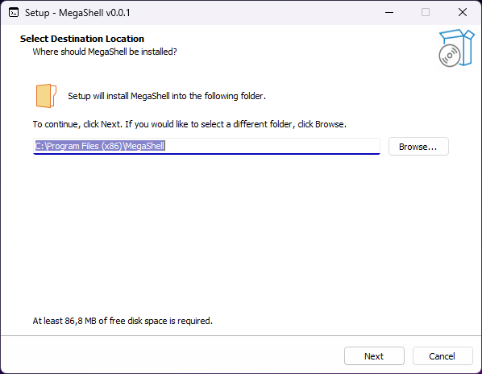

# MegaShell
This is a fully functional terminal written in Python.

Content:
- [MegaShell](#megashell)
- [Installation](#installation)
  - [Python](#python)
  - [EXE Installer (Windows only!)](#exe-installer-windows-only)
- [Usage](#usage)
  - [Parsing V1](#parsing-v1)
  - [Parsing V2](#parsing-v2)
- [Contributing](#contributing)
- [License](#license)


# Installation
There are two ways of installation. Either from Python or as an EXE installer.

## Python
This probably works for all operating systems, but I only tested this on Windows and (Kali) Linux.
At the moment the installation process is simple. Just follow these steps:
- Download this repository
- Put all files in a new dictionary on your system
- Start 'main.py'
  - Windows: Double-click on the file icon
  - Other: Run `python3 main.py` in the file folder

## EXE Installer (Windows only!)
Download the latest installer from this repository.
Start it and follow all steps.



# Usage
In general, MegaShell is a program in which any command can be added.
The easyest way to do that is by simply creating a new file in the subfolder named 'commands'. The name can be anything you want.
After creating a file just import the default libraries.

You get the most important one by just importing:
```python
from files import internal as i
```

We recommend you also import the following to create a new command as quickly as possible.
```python
# The following is needed to create commands
from files.internal import commands as c

# Print `errors`, `info`, etc
from files.internal import outputLibrary as ol

# Can clear the console or set the window title (not needed in most cases)
from files.internal import console as con

# Print library, highly recommended!
from files.internal import tools as t

# Needed when using parsing `v2`, highly recommended!
from files.commandtools import commandtools as ct
```

## Parsing V1
After that just type this in your created file:
```python
@c.command
def c_name(*extra):
    """v1"""
    t.fprint("Well done!")
```
Here is the explanation:
- By this, you created a command named `name` that prints `"Well done!"`.
- The version, in this case `v1`, specifies how to parse the given arguments. It can be `v1` or `v2`
- In `v1` only one attribute is allowed named `*extra` with just one star (!)

## Parsing V2
Now we talk about parsing `v2`, it's a bit more complex but can be used much more easily to get specific arguments.
```python
@c.command
def c_test(a="", b="", **extra):
    """v2"""
    a, b = ct.parse(extra, a, b)
    t.fprint("a: " + a)
    t.fprint("b: " + b)
```
If you read all of this, you see, this command is named `test`. The parsing version is set to `v2`.
The set variables are the ones you want to use. In this example you have to run the command like this:
```bash
test --a aValue --b "Value for B"
```
Output:
```
a: aValue
b: Value for B
```
You see strings with `'` and `"` are parsed too. The `**extra` argument is always needed to prevent errors. Unlike the one in `v1`, this is typed with two stars!
The function `commandtools.parse()` is called to translate the `extra` dictionary to the arguments.
That means you can also run the following command and still get the same output as given above.
```bash
test aValue --b "Value for B"
# OR
test --a aValue "Value for B"
# OR
test aValue "Value for B"
```
Output from all three:
```
a: aValue
b: Value for B
```

# Contributing
This is a small project by me ([@JHubi1](https://github.com/JHubi1)) and I don't have any help yet.

# License
```text
Copyright 2023 Xenia Software

Licensed under the Apache License, Version 2.0 (the "License");
you may not use this file except in compliance with the License.
You may obtain a copy of the License at

    http://www.apache.org/licenses/LICENSE-2.0

Unless required by applicable law or agreed to in writing, software
distributed under the License is distributed on an "AS IS" BASIS,
WITHOUT WARRANTIES OR CONDITIONS OF ANY KIND, either express or implied.
See the License for the specific language governing permissions and
limitations under the License.
```